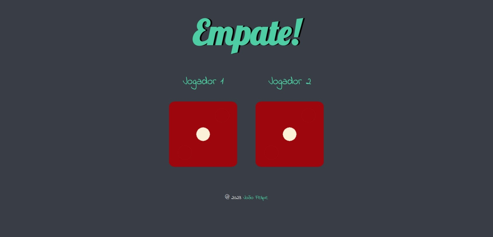

# Frontend Mentor - Results summary component solution

This is a solution to the The Dice Game of course The Complete 2023 Web Development Bootcamp  (Udemy);

## Table of contents

- [Overview](#overview)
  - [Screenshot](#screenshot)
  - [Links](#links)
- [My process](#my-process)
  - [Built with](#built-with)
  - [What I learned](#what-i-learned)
  - [Continued development](#continued-development)
  - [Useful resources](#useful-resources)
- [Author](#author)
- [Acknowledgments](#acknowledgments)

## Overview

### Screenshot

### Links

- Solution URL: [Add solution URL here](https://github.com/FelipeMT21/the-dice-game)
- Live Site URL: [Add live site URL here](https://felipemt21.github.io/the-dice-game/)

## My process

### Built with

- Semantic HTML5 markup
- CSS custom properties
- JavaScript to generate random numbers
- DOM for manipulating HTML

### What I learned

I have learned a lot about how to use javascript and DOM.

### Continued development

"I need to keep learning more about DOM and JavaScript to achieve fluency in using these tools.

### Useful resources

- [W3Sschools](https://www.w3schools.com/) - "This site helps me to search for many ways to solve my problems."
- [Developer Mozilla MDN](https://developer.mozilla.org/pt-BR/) - This is an amazing article that helped me explore various possibilities to solve my challenge. I would recommend it to anyone who is still learning this concept.

## Author

- Website - [João Felipe](https://felipemt21.github.io/curriculo/)
- Frontend Mentor - [@FelipeMT21](https://www.frontendmentor.io/profile/FelipeMT21)

## Acknowledgments

I used the Mozilla Developer Network (MDN) and W3Schools extensively to help me solve my challenges.
